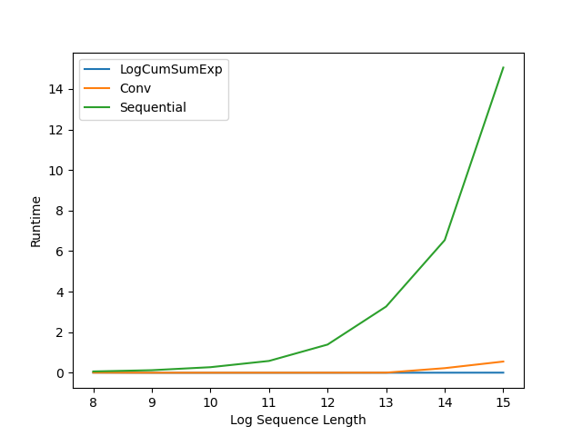

# torch_lru

This is a repo for people like me who wants a taste of the recent linear RNN boom but is stuck in pytorch.

```lru.py``` provides a minimal implementation of [linear recurrent unit (LRU)](https://arxiv.org/abs/2303.06349) in pytorch using the [logcumsumexp trick](https://arxiv.org/abs/2311.06281) to speed up the recurrent computation.

To use it:

```python
import torch
from lru import LRU

x = torch.randn((3, 3, 3))  # time x batch x emb
layer = LRU(3)
layer(x)

```
The input/output format is similar to the RNN class in pytorch.

WARNING: The ```logcumsumexp``` trick may be numerically unstable if the inputs are close to zero as log(0) is undefined, so be careful if you use ```relu``` in previous layers.

I did some quick check to make sure that the output/gradient computed using the trick is close to the ones computed with normal recursion, but use it at your own risk for large scale training.



As expected, the runtime is significantly faster than normal recursion. At sequence length $2^{15}=32768$, this implementation is about 1000x faster than normal recursion.
